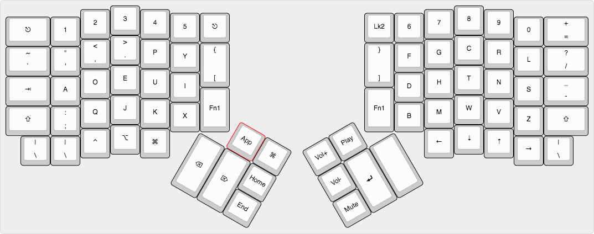

# Lee Dohm's macOS Layout

I'm still getting used to things and figuring out how things work and what would be best for my workflow. So some of the keys on this layout are currently unused or underused.

## Base Layer

This presents a mostly standard Dvorak layout.

## Arrows Layer

## Numeric Keypad

## Qwerty Layout
